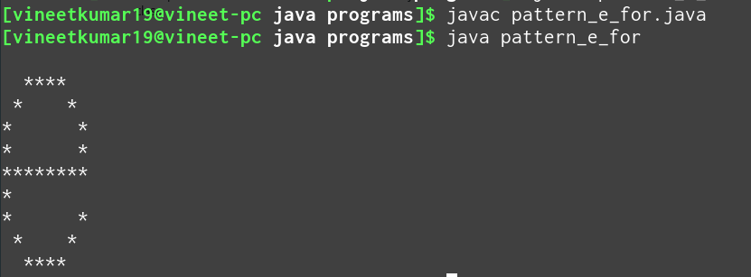

# JAVA-ASSIGNMENT
Java Assignment for printing lower case english alphabet e

Program is well documented

## PATTERN NAME
English lowercase alphabet e

## LOGIC USED

For printing pattern e, we are basically printing 9 rows [0 - 8] where each row is a component in the lowercase alphabet e. 

0. **4 consecutive zeroes** In row 0, we print 4 consecutive zeroes.
1. **upper curve** It handles the left and right upper curve.
2. **upper curve** It also handles the left and right upper curve of the pattern.
3. **row 3**
4. **straight line** In row 4, we print a straight line.
5. **single star** In row 5, we print a single star on the left edge of the pattern.
6. **lower curve** It handles the left and right lower curve.
7. **lower curve** It also handles the left and right lower curve.
8. **4 consecutive zeroes** Finally we print 4 consecutive zeroes in the last row.

## NAME OF CODERS
Vanshika Dua

Vineet Kumar

## SCREENSHOT of output

